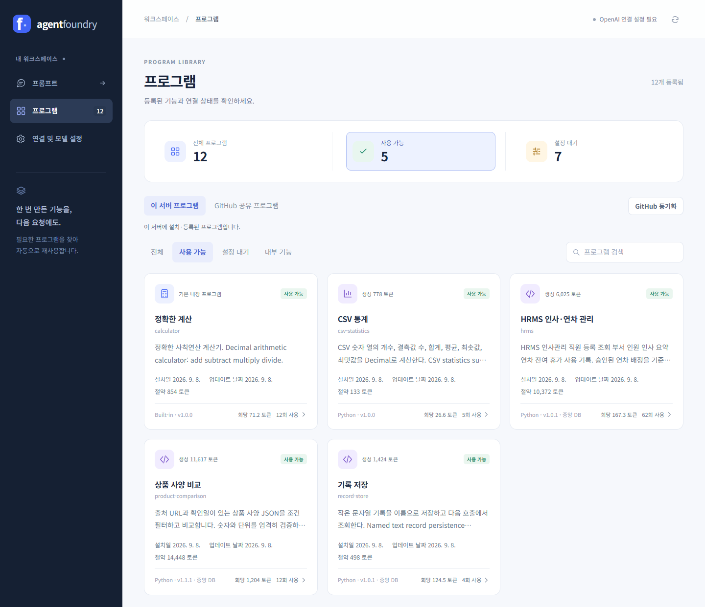

# Agent Foundry

[프로그램 저장소](https://github.com/qmdch1/agent-tools) · [AI 연결 가이드](LOCAL_MCP.md) · [상세 설명](REFERENCE.md) · [MIT](LICENSE)

AI가 필요한 프로그램을 찾아 실행하고, 없는 기능은 재사용 가치를 판단해 Python 프로그램으로 만드는 로컬 플랫폼입니다.
각자 PC에 설치해 MCP 지원 AI 에이전트 또는 API와 연결합니다.



프로그램별 생성·절약 토큰과 사용 횟수를 한눈에 확인합니다. 로컬 실행 화면이며, [토큰 집계 기준](REFERENCE.md#프로그램-사용량과-hrms)에 따라 계산값이 포함됩니다.

## 얻는 이점

- 반복 작업을 프로그램으로 처리해 LLM 호출과 토큰 사용을 줄입니다.
- 계산·데이터 처리를 코드로 실행하고 저장된 결과를 재사용합니다.
- 생성 작업은 별도 Worker에서 처리하며, 프로그램은 Git으로 관리합니다.

## 동작 순서

1. 프롬프트를 보고 설치된 프로그램과 GitHub 카탈로그를 검색합니다.
2. 사용할 프로그램이 있으면 실행해 답변합니다.
3. 없으면 먼저 답변하고, 재사용할 기능을 백그라운드에서 생성·테스트·설치합니다.

MCP에서는 연결한 AI의 사용 규칙에 따라 이 흐름을 실행합니다. 공유를 설정하면 생성한 프로그램을 개인 GitHub 저장소에 push합니다.

## 설치

Git, Python 3.12 이상, uv와 실행 중인 Docker Engine/Compose가 필요합니다.

```bash
git clone https://github.com/qmdch1/agent-foundry.git
cd agent-foundry
uv sync --frozen
uv run foundry init-env --local
docker compose --profile images build sandbox-image
docker compose up -d --build api builder
```

Linux는 실행 전 Docker socket 그룹을 설정하세요. [운영체제별 설치 안내](LOCAL_MCP.md#1-준비-및-설치)

[웹 설정](http://localhost:8000/#settings)에서 개인 API 키와 모델을 연결합니다. 기존 계산기는 API 키 없이 사용할 수 있습니다.

## AI에 연결

```bash
uv run foundry mcp-config
```

출력된 설정을 AI 앱에 등록하고 연결을 다시 시작합니다. [MCP 등록 및 자동 사용 규칙](LOCAL_MCP.md#2-codex에-mcp-등록)

AI에게 설치를 맡기려면 다음과 같이 요청하세요.

> https://github.com/qmdch1/agent-foundry 의 README를 읽고 내 PC에 설치한 뒤, MCP와 이 프로젝트의 자동 사용 규칙을 연결해줘.

기본 설치는 로컬에 저장하며 자동 push는 꺼져 있습니다. [공유·복구 방법](DEPLOYMENT.md) · [생성 템플릿](BUILD_TEMPLATES.md)
