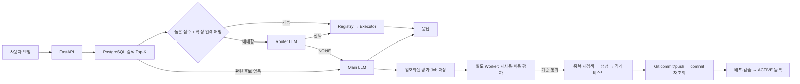

# Agent Foundry

사용자 자연어 요청에서 필요한 프로그램만 검색하고, 재사용 가능한 Python 기능을 별도 Worker에서
생성·검증·배포하는 실행 가능한 MVP입니다. OpenAI 외 여러 AI 제공자를 선택해 연결할 수 있으며
제공자 주소와 Main / Router / Evaluator / Builder 모델은 웹 설정 또는 환경설정으로 지정합니다.

메인 저장소는 [agent-foundry](https://github.com/qmdch1/agent-foundry), 생성 프로그램 저장소는
[agent-tools](https://github.com/qmdch1/agent-tools)입니다. 로컬 폴더도 서로 분리합니다.

```text
projects/
  agent-foundry/    # 이 저장소: API·Registry·검색·Router·Executor·Builder
  agent-tools/      # 별도 Git 저장소: tools/<name>/ 소스·manifest·테스트
```

## 요청 처리



Router는 후보의 `program_id`, 설명, 스키마, 예시만 봅니다. endpoint, 서버 위치, 실행 명령,
Git 경로, credential은 후보 JSON에 포함하지 않습니다. 검색 Top-K와 Router 문자 예산을
모두 제한합니다. 명확한 요청은 LLM을 전혀 호출하지 않으며, 결과 설명도 요청할 때만 생성합니다.
프로그램 조합은 순차 실행과 `{"$from_step":1,"path":["field"]}` 입력 참조를 지원합니다.

Main LLM 응답 생성 후 짧은 PostgreSQL outbox INSERT를 수행하고 응답합니다. 평가나 Builder
완료를 기다리지 않습니다. 평가 Job은 기본 2초 이후 실행 가능합니다. 클라이언트의 응답 수신
완료와 Worker 시작을 엄격히 동기화하지는 않습니다. INSERT가 실패하면 작업 유실을 숨기지 않고
요청 오류를 반환합니다. Redis나 인메모리 BackgroundTasks에 의존하지 않습니다.

## 로컬 설치

Python 3.12+, uv, Git, Docker Engine/Compose가 필요합니다.

```bash
cd /home/bespin_user/projects
git clone https://github.com/qmdch1/agent-foundry.git
git clone https://github.com/qmdch1/agent-tools.git
cd agent-foundry
uv sync --frozen --extra dev
uv run foundry init-env
docker compose up -d postgres
uv run foundry migrate
docker compose --profile images build sandbox-image
uv run uvicorn agent_foundry.api:app --host 127.0.0.1 --port 8000
```

다른 터미널에서 `uv run foundry worker`를 실행합니다. 웹의 연결 및 모델 설정 또는 `.env`에
API 제공자 주소, API key, 역할별 모델을 지정해야 일반 LLM 답변과 자동 생성이 작동합니다. 키·비밀번호를 터미널 출력,
Git 또는 Registry에 복사하지 않습니다. 모델 이름을 임의의 제품으로 고정하지 않았습니다.
LLM이 설정되지 않아도 계산기와 이미 등록된 명확한 프로그램 요청은 실행할 수 있습니다.

`init-env`는 기존 `.env`를 덮어쓰지 않고 별도 사용자/관리자 키, DB 비밀번호, Job 암호화 키,
프롬프트 HMAC 키를 무작위로 만듭니다. `.env`는 Git에서 제외됩니다.

## 웹 워크스페이스

서버 실행 후 [http://localhost:8000](http://localhost:8000/)에서 웹 화면을 사용합니다.
별도 프런트엔드 서버나 Node.js 설치는 필요하지 않습니다.

- **프롬프트**: 요청 입력, 프로그램 예시, 실행 결과, AI 답변, 실행 경로와 소요 시간을 확인합니다.
  `Ctrl+Enter`로 요청을 보낼 수 있습니다. 프로그램 자동 생성과 결과 설명 여부를 각각 선택합니다.
  화면에 이전 응답을 유지하지만, 현재 각 요청은 독립적으로 처리됩니다. 대화 문맥을 다음 요청에
  자동 전달하지 않으며, 새로고침하면 화면의 응답은 사라집니다.
- **프로그램**: 실제 Registry의 프로그램을 검색하고 사용 가능·설정 대기·내부 기능으로 구분합니다.
  ‘이 서버 프로그램’과 ‘GitHub 공유 프로그램’을 구분합니다. 설치일, 호출 횟수, 추정 절약 토큰,
  버전, 입력 형식, 요청 예시를 확인하고 공유 프로그램의 설치를 요청할 수 있습니다.
  목록은 50개씩 조회하며 관리자는 별도 에이전트의 작업 상태도 확인합니다.
- **연결 및 모델 설정**: OpenAI, Claude, Gemini, DeepSeek, Groq, Mistral, OpenRouter 또는 직접 연결을 선택합니다.
  제공자 기본 주소가 자동 입력되고 공식 콘솔 로그인·API 키 발급·연결 가이드 링크와 안내가 바뀝니다. API 키로 실제 모델 목록을
  조회합니다. Main / Router / Evaluator / Builder 모델을 별도로 지정할 수 있습니다.
  `/models` 조회를 지원하지 않는 제공자는 모델 이름을 직접 입력합니다. 연결 확인은 모델 목록
  조회이며, 모든 모델의 추론 권한이나 JSON 출력 지원까지 보장하는 검사는 아닙니다.

### 프로그램 사용량과 HRMS

프로그램 카드의 `회당 N 토큰`은 누적 절약 토큰을 전체 사용 횟수로 나눈 값이며,
사용 이력이 없으면 0, 소수점은 최대 한 자리로 표시합니다. 절약량의 비교 기준과 계산 방식은 기존 사용량 기록에 보존됩니다.

아이콘 오른쪽의 `생성 N 토큰`은 프로그램 저장소의 `tools/<name>/generation_tokens.txt`에 담긴 생성·수정 누적 합계입니다.
파일에는 최종 정수 한 줄만 저장하며, 수정할 때 기존 합계에 해당 작업의 실제 입력·출력 토큰을 한 번 더합니다.
코드 생성과 수정 재시도는 포함하고, 일반 답변·Router·재사용 평가는 제외합니다. 작업별 상세 내역과 프롬프트는 Git에 넣지 않습니다.
Builder는 생성 작업의 사용량을 별도로 집계한 뒤 커밋 전에 파일을 작성합니다. 수정 작업은 동일한 `add_tokens` 함수를 사용하거나
`foundry tool-tokens <프로그램폴더> --add <해당수정의실제사용토큰>`으로 최종값을 갱신한 뒤 코드와 함께 커밋합니다.
최초 생성에만 `--initial`을 사용하며 기존 파일은 덮어쓰지 않습니다. 명령은 저장소 작업자가 단독으로 한 번 실행합니다.
일부 사용량이나 과거 생성 기록이 없으면 파일에 `미집계` 한 줄을 유지하며 화면에도 미집계로 표시합니다.
기존 HRMS 등의 외부 생성 토큰은 소급 추정하지 않습니다. 설치·복구·GitHub 목록 동기화 시 해당 commit의 파일을 DB에 반영하므로 다른 서버에도 최종값이 전달됩니다.

공유 저장소의 `tools/hrms`는 직원 등록·조회, 부서 인원, 연도별 연차 잔여량과 중복 방지 휴가 기록을 처리합니다.
예를 들어 `HRMS 직원 DEMO001 조회`, `HRMS 연차 DEMO001 2026 잔여`, `HRMS 인사 요약`을 입력합니다.
`HRMS`처럼 프로그램 이름으로 시작하는 요청도 제한된 후보 검색에 포함하며,
입력 규칙과 스키마 검증이 성공한 경우에만 LLM 없이 바로 실행합니다.
HRMS는 중앙 DB의 전용 스키마에 인사 정보를 보관하는 기본 기능이며, 급여·근태·법정 연차 자동 산정·결재는 포함하지 않습니다.
등록 시 인사 담당자가 승인한 연차 배정일수를 명시적으로 입력합니다. 검증에는 가상 직원만 사용합니다.

### AI 제공자 연결

현재 하나의 활성 제공자 연결을 저장하고 Main·Router·Evaluator·Builder가 함께 사용합니다.
제공자 선택 → 공식 콘솔 로그인·키 발급 → API 키 입력 → 연결 확인 및 모델 가져오기 → 역할별 모델 선택 → 설정 저장 순서입니다.
선택한 제공자의 **연결 시작하기** 영역에서 공식 콘솔, 키 관리 화면, 시작 가이드를 새 탭으로 엽니다.
Mistral은 콘솔의 API Keys 메뉴로 이동합니다. 직접 연결에는 외부 링크 대신 관리자에게 받은 주소·인증 정보 안내를 표시합니다.
이 기능은 공식 사이트 바로가기입니다. 로그인 링크를 여는 동작만으로 API 인증이나 설정 저장이 이루어지지 않으며,
OAuth 승인·콜백을 통한 자동 연결은 구현하지 않았습니다. 발급한 API 키를 입력하고 모델을 선택한 뒤 저장해야 합니다.
공식 시작 가이드: [OpenAI](https://developers.openai.com/api/docs/quickstart),
[Claude](https://platform.claude.com/docs/en/get-started), [Gemini](https://ai.google.dev/gemini-api/docs/api-key?hl=ko),
[DeepSeek](https://api-docs.deepseek.com/), [Groq](https://console.groq.com/docs/quickstart),
[Mistral](https://docs.mistral.ai/getting-started/quickstarts/studio/activate-and-generate-api-key),
[OpenRouter](https://openrouter.ai/docs/cookbook/get-started/quickstart).
모델을 바꿀 때 제공자가 반환한 모델 ID를 사용하며 모델명이나 유료 모델을 임의로 고정하지 않습니다.
제공자를 바꾸면 입력 중인 키·모델 목록을 초기화합니다. 이전 키는 서버에서 새 제공자나 다른
API 주소로 재사용하지 않습니다. 기존 연결은 새 설정을 저장하기 전까지 계속 적용됩니다.

| 제공자 | 기본 API 주소 | 구현 기준 |
| --- | --- | --- |
| OpenAI | `https://api.openai.com/v1` | 기존 Chat Completions 연결 |
| Anthropic Claude | `https://api.anthropic.com/v1` | [Messages API](https://platform.claude.com/docs/en/api/messages/create) · 전용 인증 헤더 |
| Google Gemini | `https://generativelanguage.googleapis.com/v1beta` | [generateContent API](https://ai.google.dev/api/generate-content) · 전용 인증 헤더 |
| DeepSeek | `https://api.deepseek.com` | [OpenAI 호환 연결](https://api-docs.deepseek.com/) |
| Groq | `https://api.groq.com/openai/v1` | [OpenAI 호환 연결](https://console.groq.com/docs/openai) |
| Mistral AI | `https://api.mistral.ai/v1` | [Chat API](https://docs.mistral.ai/api/endpoint/chat) |
| OpenRouter | `https://openrouter.ai/api/v1` | [Chat API](https://openrouter.ai/docs/api/reference/overview) |
| 직접 연결 | 사용자가 입력 | OpenAI 호환 Chat Completions + `/models` |

제공자 정의는 `providers.py` 한 곳에서 관리하고 UI에 전달합니다. SDK 추가 없이 기존 HTTP 계층을
사용합니다. Claude와 Gemini의 페이지 단위 모델 목록을 제한된 범위에서 조회하며, Gemini의
generateContent 미지원 모델과 Mistral의 대화 미지원 모델은 제외합니다. 다른 제공자는 목록에서
대화·JSON 출력이 가능한 모델을 선택해야 합니다. 모델 조회 시에는 유료 답변 생성 호출을 하지 않습니다.

JSON이 필요한 작업은 Claude에 JSON 객체 출력을 지시하고 서버에서 파싱·검증합니다. Gemini는
JSON 응답 형식을, 호환 API는 JSON object 형식을 요청합니다. 불완전한 응답·거부·잘못된 JSON을
성공으로 처리하지 않습니다. 토큰 통계는 제공자별 입력·출력·캐시/추론 사용량 형식을 정규화하고
제공자·모델·역할과 함께 기록합니다. 요금이나 모델별 성능은 추정하지 않습니다.

환경변수만 사용하는 경우 `FOUNDRY_LLM_PROVIDER`와 `FOUNDRY_LLM_BASE_URL`을 함께 지정합니다.
제공자를 생략하면 알려진 기본 주소에서 추론하며, 저장된 웹 설정이 환경변수보다 우선합니다.
실제 제공자별 추론·계정 권한은 해당 계정의 API 키와 모델을 연결한 환경에서 확인합니다.

로컬에서 로그인 없이 모든 관리자 기능을 쓰려면 `.env`에 `FOUNDRY_LOCAL_ADMIN=true`를 설정하고
API를 다시 시작합니다. `localhost`, `127.0.0.1`, `::1` 주소에서는 웹·API에 접속 키가 필요 없으며
화면에 **로컬 관리자**로 표시합니다. 현재 로컬 설치에는 이 모드를 적용했습니다.
Compose의 `127.0.0.1` 포트 바인딩을 유지합니다. 다른 웹사이트에서 보낸 브라우저 요청은 거부합니다.
외부 운영으로 전환할 때는 `FOUNDRY_LOCAL_ADMIN=false`로 바꾸면 기존 인증을 다시 사용합니다.
새 설치의 기본값은 `false`입니다.

인증 모드에서는 최초 접속에 `.env`의 `FOUNDRY_ADMIN_KEY`를 워크스페이스 접속 키로 사용합니다.
`FOUNDRY_API_KEY`로 접속한 일반 사용자는 공개 프로그램과 프롬프트만 사용합니다.
관리자가 로컬 터미널에서 다음 명령을 실행하면 키를 브라우저에 입력하지 않고 시작할 수 있는
**5분 유효·1회 사용 관리자 연결 링크**를 받습니다. 이 링크를 공유하거나 로그에 보관하지 않습니다.

```bash
# 로컬 Python 실행
uv run foundry web-login
# Docker Compose 실행
docker compose exec -T builder foundry web-login
```

다른 주소로 접속한다면 `--url https://your-agent.example`을 지정합니다. 로그인 후 URL에서
일회용 토큰을 제거하며 서버에는 토큰 해시만 저장합니다. 세션은 기본 8시간이고 로그아웃하면
즉시 폐기합니다. HttpOnly / SameSite 쿠키와 동일 출처·CSRF 검사를 적용합니다.

**OpenAI 연결은 API 키 인증입니다. ChatGPT 로그인이나 구독을 연결하는 기능이 아닙니다.**
API 키는 브라우저 저장소에 보관하지 않으며, 저장 후 읽어오는 API에도 반환하지 않습니다.
주소와 역할별 모델을 포함한 전체 설정은 PostgreSQL에 암호화해 저장하고 API와 Worker가 다음
LLM 호출부터 함께 적용합니다. 웹 저장값이 `.env`의 초기값보다 우선합니다.
암호화에 쓰는 `FOUNDRY_JOB_ENCRYPTION_KEY`는 DB와 분리해 보관하고 서버 이전 시 함께 복구합니다.
기존 설치는 새 버전을 올린 뒤 `foundry migrate`로 웹 설정·세션 테이블을 추가해야 합니다.

사설/로컬 제공자는 서버에서 `FOUNDRY_LLM_PRIVATE_HOSTS='["llm.internal"]'`처럼 호스트를
명시적으로 허용합니다. 기본값은 공개 HTTPS API만 허용합니다. 외부 공개 시 신뢰된 리버스
프록시에서 TLS와 접근 제한을 적용하고 전달된 호스트·프로토콜이 실제 웹 주소와 일치하게 설정합니다.

## Docker Compose로 전체 실행

```bash
docker compose --profile images build sandbox-image
docker compose up -d --build api builder
```

Compose는 Registry DB 1개, migration 작업, API, Worker를 구성합니다. 생성된 Tool마다 DB를
만들지 않습니다. API와 Worker는 별도 프로세스이며, Worker는 한 번에 한 생성 작업만 수행합니다.
기본 포트는 localhost의 API 8000, Registry 55439입니다.

Compose 내부 생성 저장소는 별도 `tools-checkout` 볼륨의 `/tools-repository`에 clone됩니다.
호스트의 `../agent-tools` 작업 파일과 섞이지 않습니다. 로컬 Python 실행에서는
`FOUNDRY_TOOL_REPOSITORY_ROOT=../agent-tools`를 사용합니다. 양쪽 모두 같은 별도 Git 원격을 씁니다.

Linux에서는 `DOCKER_GID`에 Docker socket의 그룹 ID를 설정합니다. API/Worker는 신뢰된
제어 계층으로 Docker socket에 접근합니다. 이 접근 권한은 호스트 관리 권한에 해당하므로
외부에 socket을 노출하지 않습니다. 생성 Tool에는 socket, 호스트 디렉터리, 서비스 환경변수,
API 키를 전달하지 않습니다. 플랫폼 컨테이너와 생성 Tool은 UID 10001로 실행합니다.

Private Git 원격은 서버의 credential helper를 사용하거나 `FOUNDRY_GIT_TOKEN`으로
**agent-tools 저장소만 접근 가능한** 토큰을 연결합니다. 내장 helper는 설정된 HTTPS 원격
호스트에만 Git의 내부 파이프로 토큰을 전달합니다. 토큰은 코드나 DB에 저장하지 않습니다.

## API

사용자는 `Authorization: Bearer <FOUNDRY_API_KEY>`, 관리자는 별도 `FOUNDRY_ADMIN_KEY`를 사용합니다.

```json
POST /v1/agent
{"prompt":"0.1 + 0.2","explain_result":false,"allow_build":true}
```

```json
{"request_id":"...","route":"deterministic","answer":null,
 "result":{"result":"0.3"},"programs":["..."],"evaluation_job_id":null}
```

| API | 용도 |
| --- | --- |
| `GET /health/live`, `/health/ready` | 프로세스·Registry 상태 |
| `POST /v1/agent` | 검색·선택·실행 또는 일반 LLM 응답 |
| `GET /v1/programs/search?q=...&source=installed` | 로컬 공개 후보 검색 (`source=github`는 공유 후보) |
| `GET /admin/jobs/{id}` | 생성/평가 진행 상태, 암호화 payload는 제외 |
| `GET /admin/programs`, `/admin/metrics` | 사용량·오류·지연·실측 token usage |
| `POST /admin/programs/{id}/execute` | 관리자용 primitive 실행 |
| `POST /admin/reconcile` | 다른 서버에서 활성 프로그램 재구성 Job |
| `POST /admin/rollback` | `program_id`, `commit`으로 이전 안정 버전 복귀 Job |

프롬프트 원문은 감사 이벤트에 저장하지 않고 HMAC만 기록합니다. 평가 Queue에는 재사용 판정을
위해 원문이 잠시 필요하므로 Fernet으로 암호화하고 완료·실패 시 payload를 제거합니다.
직접 식별자나 실제 입력을 생성 코드에 포함하지 않도록 Evaluator와 Builder의 지침도 분리했습니다.
LLM 제공자에게 프롬프트를 전달하는 동작은 일반 LLM 사용과 동일합니다.

## 기본 프로그램과 등록

### 로컬 우선 검색과 서버 간 프로그램 공유

요청은 **설치된 Registry 검색 → 공유 GitHub 카탈로그 검색 → 필요한 프로그램 설치 또는
일반 LLM 답변 → 별도 Worker의 최신 Git 재검색 → 재사용 평가 → 필요한 경우 생성** 순서로 처리합니다.
프로그램 생성·테스트·Git commit/push·배포·등록은 모두 `builder` 서비스의 별도 프로세스가 수행합니다.
API 서버는 DB 조회와 작업 등록만 수행하고 설치나 생성을 기다리지 않습니다.

Worker는 승인된 `agent-tools` 저장소의 pushed branch를 기본 60초마다 fetch하여
`tools/<name>/manifest.json`을 `agent.catalog`에 색인합니다. 프로그램 소스는 DB에 저장하지
않습니다. 실제 설치 목록인 `agent.programs`와 공유 목록은 분리되며 Router는 각 검색 단계의
Top-K만 봅니다. 요청마다 Git 전체를 내려받거나 전체 목록을 LLM에 전달하지 않습니다.
소스가 바뀐 Tool만 메타데이터를 다시 읽고, 관계없는 README/다른 Tool 변경은 기존 Tool의
배포 commit을 바꾸지 않습니다.

공유 프로그램이 발견되면 `INSTALL` 작업을 등록하고 설치 대기 응답을 반환합니다. Worker가
정확한 commit을 가져와 격리 테스트·입출력 검증을 통과한 뒤 로컬 Registry를 ACTIVE로 등록합니다.
화면의 설치 완료 알림 이후 같은 요청을 다시 실행합니다. 최초 요청을 자동 재실행하지는 않습니다.
AI 연결이 없거나 실패해도 `DISCOVER` 작업으로 공유 프로그램을 확인할 수 있습니다.

생성 전에는 캐시만 믿지 않고 최신 Git을 다시 확인합니다. Git fetch 또는 manifest 검증에
실패하면 기존 색인을 유지하고 신규 생성을 중단합니다. Git 검색 장애를 ‘프로그램 없음’으로
처리하지 않습니다. 애매한 기존 기능 중복은 확장 검토로 남깁니다. 자동 생성의 재사용·비용 기준은
동일하게 적용하며 단순 질의마다 새 프로그램을 만들지 않습니다.

다른 메인 서버는 **독립된 빈 DB**로 시작해도 같은 Git 저장소를 설정하고 migration·Worker를
실행하면 공유 목록을 발견합니다. 사용하거나 설치를 요청한 프로그램만 해당 서버에 검증·설치합니다.
동일한 공개 프로그램을 발견하는 데 첫 서버의 DB 백업은 필요하지 않습니다. 첫 서버의 운영
데이터·설정·통계를 복구하려는 경우에는 여전히 DB 백업과 암호화 키가 필요합니다.

```bash
# Worker가 자동 동기화하며, 필요하면 관리자가 별도 CLI 프로세스로 즉시 동기화할 수 있습니다.
docker compose exec -T builder foundry catalog-sync
```

Private 저장소는 각 서버에 읽기 credential이 필요합니다. 자동 생성 Worker의 push에는 별도의
쓰기 credential(`FOUNDRY_GIT_TOKEN` 또는 credential helper)이 필요합니다. Compose에서는
`.worker.env`에 `FOUNDRY_GIT_TOKEN`을 저장하면 Worker에만 전달됩니다. 파일 권한은 0600으로
제한하고 Git과 Docker build context에서 제외합니다. Git helper는 설정된 저장소의 HTTPS
호스트와 경로가 모두 일치할 때만 인증을 제공합니다. 선택적 env 파일 기능은 Compose 2.24+
버전이 필요합니다. Push가 실패한
local commit은 공유 카탈로그에 나타나지 않으며 활성 배포로 등록하지 않습니다.

### 설치·호출·토큰 통계

`agent.programs`는 설명, 최초 `installed_at`, 최근 `last_deployed_at`, 호출/성공/실패 횟수,
평균 지연, `estimated_tokens_saved`, `attributed_llm_tokens`, `savings_sample_count`를 저장합니다.
업그레이드·재설치·rollback 때 최초 설치일과 누적 통계를 유지합니다. 과거 배포의 설치일은
기존 생성 시각에서 이관하며, 토큰 절감 통계는 이 기능 적용 이후의 요청부터 누적합니다.

`agent.request_usage`에는 프롬프트 HMAC, 실제 응답 경로의 LLM 토큰 사용량, 비교 기준 토큰,
추정 절감량과 추정 방법을 기록합니다. 같은 프롬프트에 대한 과거 실제 Main LLM 응답 토큰을
우선 기준으로 삼고, 없으면 설정된 바이트/토큰 비율과 고정 오버헤드를 사용합니다.
추가 LLM 호출로 절감량을 측정하지 않습니다. Router·결과 설명 호출 토큰은 절감량에서 차감합니다.
제공자가 usage를 반환하지 않으면 해당 요청의 절감량을 미상으로 남깁니다. 여러 프로그램을
조합한 요청은 절감량을 한 번만 계산해 나누므로 중복 합산하지 않습니다.

‘절약 토큰’은 **동일 요청을 LLM으로 처리했을 경우와 비교한 추정치**이며 실측 절감 보장이나
생성 비용을 포함한 순이익이 아닙니다. 모델·입력·출력에 따라 오차가 있습니다. 생성·평가 토큰은
기존 역할별 LLM 이벤트에서 별도로 확인할 수 있습니다.

Migration/Seed는 calculator만 ACTIVE로 등록합니다. File Reader/Writer와 승인된 DB Query는
관리자 전용이며 `foundry enable-primitive <name>`으로 명시적으로 활성화합니다.
File Writer는 지정 디렉터리에 새 파일만 생성합니다. 기존 파일을 덮어쓰지 않습니다.
DB Query는 설정의 `query_id -> SELECT` 템플릿과 별도 읽기 전용 연결만 사용합니다.
AI용 템플릿과 DB 계정은 승인된 Gold/Semantic View만 읽도록 권한을 부여해야 합니다.

HTTP/API caller, Web/Search adapter, Python Executor, Builder 내부 기능은 내부 primitive
항목으로 Seed합니다. 미설정 endpoint를 실행하거나 사용자에게 임의 shell/Python 실행기를
노출하지 않습니다. 실제 API는 고정 HTTPS endpoint, secret_name, 입력/출력 스키마와 예시를
가진 manifest로 `foundry register-api <manifest.json>`에서 등록합니다. host allowlist 및
예시 호출 검증이 성공해야 활성화됩니다. 리다이렉트와 사설 주소를 차단합니다.

초기 `csv-statistics`는 표준 인터페이스의 직접 작성한 예제입니다. 등록하려면 원격에 존재하는
**full 40자리 commit**을 사용합니다.

```bash
uv run foundry deploy tools/csv-statistics <40-character-agent-tools-commit>
```

문법 검사 → dependency 설치(있을 경우) → pytest → 예시 입출력 schema/expected 값 검사 →
독립 컨테이너에서 예시 반복 실행 → Git commit/push → 원격 commit 재조회 → 배포/검증 → ACTIVE
순서를 지킵니다. 첫 검증 전에 이미지를 구성하지만 검증되지 않은 Tool은 사용자 실행 대상으로
등록되지 않습니다. 프로세스 도구의 health check는 실제 CLI 예시 실행입니다.

## 자동 생성 범위와 비용

현재 자동 생성 대상은 **Python 데이터 처리 도구와 자체 데이터를 중앙 DB에 저장하는 도구**입니다.
DB가 필요한 도구는 `requires_db=true`, `network=database`, 선언적 `tables`를 지정합니다.
별도 Worker가 프로그램 전용 스키마·계정을 만들고 실행 시 연결 정보를 주입합니다.
외부 시스템 접근은 관리자가 등록한 HTTP/DB adapter로 제공합니다. 생성 파일은 app Python,
tests Python, README로 제한하며 manifest와 requirements는 검증된 구조에서 저장합니다.
모델이 Dockerfile, Compose, shell 또는 SQL을 만들어 제어 계층에서 실행하게 하지 않습니다.

일반 도구는 네트워크를 차단합니다. DB 도구만 중앙 PostgreSQL에 연결된 내부 Docker 네트워크를
사용합니다. 모든 도구에 read-only root, non-root, CPU/RAM/PID 제한, timeout, 출력 크기 제한을 적용합니다.
CLI timeout 때 Docker 컨테이너도 명시적으로 제거합니다. 기본 의존성은 표준 라이브러리이며
외부 패키지는 관리자가 승인한 `package==version -> wheel SHA256`만 설치합니다. 설치는
binary wheel, no-deps, require-hashes로 제한하고 생성 코드를 빌드 중 실행하지 않습니다.

Benefit은 여섯 점수의 설정 가중평균에서 유지 비용을 차감합니다. 점수 임계값뿐 아니라
`예상 절약 토큰 × 예상 재사용 횟수 / 생성·유지 비용 단위`도 기준을 넘어야 합니다.
이 값은 예측치이며 실제 사용량 측정과 구분합니다. LLM으로 정확도나 성능 향상을 보장했다고
기록하지 않습니다. 단순 질문·짧은 계산은 생성 후보에서 제외하도록 평가합니다.

Builder는 재검색·배포를 같은 advisory lock 안에서 수행합니다. 관련 도구가 있으면 새로 만들지
않고 `reuse_or_extension_review`로 남깁니다. 기존 도구를 자동 수정하는 기능은 MVP에 포함하지
않습니다. 작업은 `PENDING -> RUNNING -> SUCCEEDED/SKIPPED/FAILED` 상태와 lease/owner를
가지며 heartbeat, SKIP LOCKED, 장애 후 lease 회수, 오래된 owner의 완료 차단을 구현했습니다.
수정 시도와 작업 재수행 횟수에 상한이 있습니다.

## 복구·롤백·DB

```bash
uv run foundry reconcile
uv run foundry rollback <program-id> <previous-stable-commit>
```

새 서버에 메인 저장소/의존성/환경변수를 설치하고 Registry DB 백업을 복원한 뒤 reconcile을
실행합니다. Registry의 ACTIVE commit을 원격에서 가져와 테스트하고 로컬 실행 정보를 재구성합니다.
Git에는 schema·seed·manifest·소스만 저장합니다. Registry, Tool 데이터 및 파일 자료는
Git으로 복구되지 않으므로 별도의 DB/파일 백업이 필요합니다.

이전 stable release의 manifest와 테스트 증거를 보존합니다. 실패한 배포는 Registry의 기존
버전 포인터를 바꾸지 않습니다. rollback은 이전 commit을 다시 테스트한 다음 포인터를 바꿉니다.
Push 실패로 로컬 commit만 남으면 활성화하지 않습니다. Git 문제를 해결해 해당 commit을 push한 뒤
`foundry deploy tools/<name> <commit>`으로 재개할 수 있습니다. 기존 dirty checkout은 거부합니다.

### 중앙 DB와 프로그램별 스키마

PostgreSQL 하나의 전용 Foundry DB를 공유합니다. 메인 관리 정보는 `agent` 스키마에,
각 DB 사용 프로그램의 테이블은 `tool_<program UUID hex>` 스키마에 저장합니다.
DB를 사용하지 않는 계산·통계 도구에는 빈 스키마를 만들지 않습니다.

설치 Worker는 임시 스키마에서 테스트 → 운영 스키마/계정 생성 → 추가형 migration →
실제 계정 연결 확인 → ACTIVE 등록을 수행합니다. `agent.program_databases`에 프로그램 ID,
중앙 연결 참조, 스키마/계정, secret 참조, 상태와 생성일을 보관합니다. 비밀번호는 기존
`FOUNDRY_JOB_ENCRYPTION_KEY`로 암호화하며 Git·manifest·로그·웹 응답에 노출하지 않습니다.
프로그램 상세 화면에서 중앙 DB 연결 여부와 스키마를 확인할 수 있습니다.

각 실행 계정은 자기 스키마의 테이블에만 조회·삽입·수정·삭제 권한을 갖습니다. 다른 프로그램과
`agent` 스키마 접근, 테이블 생성/삭제, TRUNCATE, 임시 테이블 생성, 권한 승격은 허용하지 않습니다.
전용 Foundry DB에서 PUBLIC의 CREATE/TEMP와 agent/public 스키마 접근을 회수합니다.
이미 다른 시스템이 사용하는 DB에 이 플랫폼을 합치지 마십시오. Worker의 DB 관리 계정에는
스키마·역할 생성/권한 부여 권한이 필요합니다. 생성 도구에는 관리 계정 정보를 전달하지 않습니다.

생성 Python은 플랫폼에 포함된 `psycopg`로 `FOUNDRY_TOOL_DATABASE_URL` 환경변수에 연결합니다.
테이블 이름은 스키마 없이 사용하고 입력 값은 SQL 매개변수로 전달합니다.
`FOUNDRY_TOOL_SCHEMA`도 제공하지만 모델이 스키마명·주소·비밀번호를 결정하지 않습니다.
정의는 manifest의 `tables`와 자동 작성된 `migrations/001_tables.json`으로 Git에 저장합니다.
테이블/열 추가와 일반 인덱스만 지원하며 키 제약, 기존 타입 변경, 파괴적 SQL은 생성하지 않습니다.

단위 테스트는 임시 스키마 하나를 공유하며, 각 예시와 반복 검사는 각각 빈 임시 스키마에서
실행합니다. 운영 데이터는 테스트에 사용하지 않습니다. 테스트가 끝나면 플랫폼이 기록한
정확한 임시 스키마/계정만 제거합니다. Worker 장애로 남은 테스트 범위는 2시간 후 회수합니다.
설치·업데이트·롤백은 같은 운영 스키마와 데이터를 유지합니다. 파괴적 데이터 변경은 백업과
복구 계획을 갖춘 별도 관리 절차가 필요하며 범용 DB DROP/TRUNCATE API는 제공하지 않습니다.

`FOUNDRY_TOOL_DATABASE_NETWORK/HOST/PORT`로 내부 Docker 연결을 설정합니다.
기본 동시 연결 제한은 계정당 2개, 기본 SQL 제한 시간은 5초, lock 대기 제한은 1초입니다.
시간 제한은 PostgreSQL 세션 기본값이며 생성 코드가 바꿀 수 있는 값이므로 강제 DB 자원 격리를
대신하지 않습니다. 전용 네트워크에는 DB 외 서비스나 Docker socket을 연결하지 마십시오.

다른 메인 서버는 Git의 같은 도구를 검색·설치하면 자신의 중앙 DB에 같은 프로그램 스키마를
새로 만듭니다. **운영 데이터는 Git으로 전달되지 않습니다.** 기존 서버를 복구할 때는 전용
DB 백업과 암호화 키를 함께 복원하고, DB 이름을 유지한 상태에서 reconcile을 실행합니다.
역할을 별도로 복원하지 않는 경우 데이터베이스 복원에 `--no-owner --no-acl`을 적용하고
Foundry 관리 계정으로 복원한 다음 reconcile로 프로그램별 권한을 재설정합니다.
관리 역할이 복원되지 않아도 등록된 암호화 연결 정보로 다시 생성합니다.

## 검증과 운영 한계

```bash
uv run ruff check .
uv run pytest -q
docker compose exec -T postgres createdb -U foundry foundry_test
uv run python scripts/run_integration.py
FOUNDRY_TEST_DOCKER=1 uv run python scripts/run_integration.py
docker compose config --quiet
```

통합 테스트는 `foundry_test` DB만 허용합니다. Docker lifecycle 테스트는 합성 LLM 응답을 사용해
실제 코드 파일 생성, 격리 테스트, 로컬 bare Git 원격 commit/push, ACTIVE 등록, 재사용, 실패한
업그레이드 차단, rollback, 빈 서버 상태에서 reconcile을 검증합니다. 유료 외부 LLM 호출의
품질/비용은 별도 제공자·모델·키를 연결한 뒤 확인해야 합니다.

HTTP allowlist는 관리자가 소유한 신뢰할 수 있는 도메인만 사용합니다. 일반 인터넷 임의 URL
fetcher가 아닙니다. 다중 테넌트 분리, 엄격한 외부 egress gateway, 작업별 허용 네트워크,
완전한 DAG 엔진, Go 생성, 자동 도구 확장, 실제 DB 백업 서비스와 스케줄링은 향후 범위입니다.
여러 Worker 서버는 같은 Registry를 사용해도 각 Executor 서버에서 reconcile해야 합니다.

상시 운영에서는 DB 이벤트/실패 build 자료/오래된 image의 보존 정책과 정리 일정을 설정하고,
리버스 프록시에서 TLS·접근 제한·rate limit을 적용합니다. 기본 Compose는 단일 서버 MVP이며
특정 고객의 기존 Airflow/DataHub 또는 Raw/Silver DB에 접속하지 않습니다.

## 확인한 공식 API 자료

- [OpenAI 호환 호출의 기준인 Chat Completions](https://developers.openai.com/api/reference/resources/chat/subresources/completions/methods/create)
- [PostgreSQL row locking / SKIP LOCKED](https://www.postgresql.org/docs/current/sql-select.html)
- [Docker 실행 및 자원 제한](https://docs.docker.com/engine/containers/run/)
